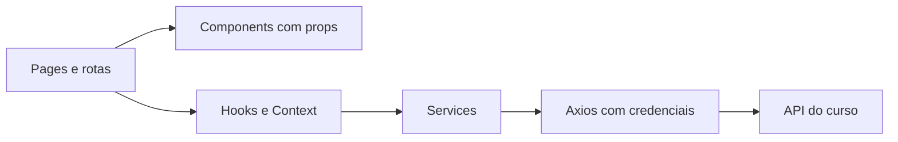

<!-- Documento: README.md -->

# ⚛️ React com TypeScript: aprender construindo

**Uma trilha de 36 etapas para consumir a API do curso, do primeiro componente ao build.**

O projeto de estudo cria uma interface de autenticação e cadastro de **clientes**. Cada conceito aparece quando uma funcionalidade pede seu uso: o login ensina estado e eventos; a sessão ensina Context e efeitos; o CRUD ensina props, callbacks, imutabilidade e reutilização.

> **📌 Importante**
>
> Este guia descreve a construção progressiva. Os exemplos em docs não alteram automaticamente os arquivos em src. A aplicação deste repositório ainda contém a implementação inicial. Para refazer o curso, use uma pasta nova; para continuar uma cópia de estudo, aplique a etapa correspondente sem reinicializar Vite sobre arquivos existentes.

## 🧭 Comece aqui

1. Confira Node.js 24.15.0 ou posterior compatível e npm. Essa versão também atende à trilha da API.
2. Conclua a [documentação da API](../api_t13/README.md), incluindo autenticação e o recurso Cliente.
3. Verifique API em localhost:3000 e frontend em localhost:5173, com a origem permitida no CORS.
4. Siga [01 · Criação básica](docs/01-criacao-basica-do-projeto.md) em uma pasta nova.
5. Conclua a conferência e a prática do capítulo antes de avançar.

Se você já seguiu as quatro etapas antigas, revise principalmente os [contratos e tipos](docs/03-servicos-e-tipagens.md) e o [login](docs/04-tela-de-login.md), depois continue pelo [Context de autenticação](docs/05-contexto-de-autenticacao.md). Os quatro nomes de arquivos originais foram preservados.

Use o **CMD** para os comandos apresentados. A raiz do frontend é a pasta que contém package.json, independentemente de seu nome.

## 📝 Como acompanhar

| Indicação no guia | Ação |
|---|---|
| Arquivo: src/pages/Login/index.tsx | Abra ou crie exatamente esse caminho dentro do frontend |
| Crie este arquivo | Crie também as subpastas necessárias e copie o bloco completo |
| Substitua todo o conteúdo | Troque a versão anterior; não acrescente outro componente ao final |
| Bloco bat | Execute no CMD, uma linha por vez; não cole no TypeScript |
| Demonstração isolada | Experimente em uma página temporária; não suponha uma funcionalidade real da API |
| Conferência | Verifique o comportamento antes de seguir; não é comprovante de execução |

Os blocos de arquivo têm caminho explícito e comentários compatíveis com seu formato. Arquivos gerados pelas ferramentas, como lockfiles e build, mantêm o formato original. TypeScript usa import type para imports exclusivamente de tipos.

## 📚 Trilha completa

| Etapa | Capítulo | Conceitos praticados |
|---|---|---|
| 01 | [Criação básica do projeto](docs/01-criacao-basica-do-projeto.md) | React, SPA, componente funcional, JSX, createRoot, StrictMode, import/export, CSS |
| 02 | [Páginas e primeiras rotas](docs/02-arquitetura-e-rotas.md) | páginas e componentes, organização, exports nomeados, props, BrowserRouter, Routes, Route, Link, CSS Modules |
| 03 | [Comunicação com a API e tipagens](docs/03-servicos-e-tipagens.md) | HTTP, Axios, Promise, interfaces, import type, services, cookies HttpOnly, CORS |
| 04 | [Construindo a tela de login](docs/04-tela-de-login.md) | useState, eventos, onChange, onSubmit, preventDefault, estado como snapshot, JSX dinâmico, ternário, async/await, try/catch/finally, useNavigate |
| 05 | [Compartilhando autenticação com Context](docs/05-contexto-de-autenticacao.md) | createContext, useContext, Provider, children, ReactNode, fluxo de dados, props, custom hook inicial |
| 06 | [Recuperando a sessão ao abrir a aplicação](docs/06-recuperando-a-sessao.md) | useEffect, dependências, cleanup, AbortController, useRef, loading inicial, race conditions, atualização funcional |
| 07 | [Protegendo rotas privadas](docs/07-rotas-privadas.md) | early return, composição, Navigate, Outlet, rotas aninhadas, autenticação e autorização |
| 08 | [Criando o layout principal](docs/08-layout-principal.md) | componentização, Fragment, composição, Outlet, NavLink, children, responsabilidade de páginas |
| 09 | [Dashboard do usuário autenticado](docs/09-dashboard.md) | useContext, JSX com expressões, props, null, renderização condicional, dados derivados |
| 10 | [Buscando os primeiros clientes](docs/10-buscando-clientes.md) | useState com array tipado, useEffect, Axios GET, Promise, loading, erro, cleanup |
| 11 | [Renderizando listas](docs/11-renderizando-listas.md) | map, arrays, expressões JSX, key, identidade de componentes |
| 12 | [Componentes reutilizáveis com props](docs/12-componentes-com-props.md) | props tipadas, destructuring, fluxo pai → filho, reutilização, responsabilidades |
| 13 | [Detalhes de um cliente](docs/13-detalhes-do-cliente.md) | useParams, parâmetro como string, validação de id, efeito dependente de URL, links |
| 14 | [Cadastrando um cliente](docs/14-cadastro-de-cliente.md) | formulário controlado, submit, objetos de entrada, POST, feedback, navegação |
| 15 | [Evoluindo o estado dos formulários](docs/15-estado-dos-formularios.md) | objetos em state, spread, imutabilidade, propriedades computadas, ChangeEvent, atualização funcional |
| 16 | [Validando o formulário](docs/16-validacao-do-formulario.md) | estado derivado, função pura, validação, atributos HTML, condicionais, callback props |
| 17 | [Editando um cliente](docs/17-edicao-de-cliente.md) | preenchimento assíncrono, estado inicial, key e remontagem, composição, PUT e PATCH |
| 18 | [Excluindo um cliente](docs/18-exclusao-de-cliente.md) | DELETE, callback props, filter, atualização funcional, eventos, estado de operação |
| 19 | [Modal de confirmação](docs/19-modal-de-confirmacao.md) | componente controlado, props, callbacks, estado booleano derivado, Modal |
| 20 | [Loading, erro e lista vazia](docs/20-estados-da-interface.md) | renderização condicional, componente reutilizável, união discriminada, dependência de retry |
| 21 | [Pesquisa e filtros](docs/21-pesquisa-e-filtros.md) | filter, includes, normalização, estado derivado, fluxo de renderização |
| 22 | [Ordenação e paginação](docs/22-ordenacao-e-paginacao.md) | sort, cópia de arrays, slice, estado derivado, paginação, parâmetros de consulta |
| 23 | [Extraindo custom hooks](docs/23-custom-hooks.md) | custom hooks, composição de Hooks, regras dos Hooks, estado local versus estado compartilhado |
| 24 | [Services por domínio](docs/24-services-por-dominio.md) | camada HTTP, services por domínio, responsabilidade única, Promise de dados, propagação de erros |
| 25 | [Feedback global com toasts](docs/25-feedback-com-toasts.md) | Context, componentes globais, callbacks, useReducer, actions, reducer puro, useRef |
| 26 | [Implementando logout](docs/26-logout.md) | POST, Context, estado global, navegação em evento, finally, limites da sessão |
| 27 | [Perfis e permissões](docs/27-perfis-e-permissoes.md) | condicionais, props, roles, composição, contratos, autorização |
| 28 | [Tratamento global de erros HTTP](docs/28-erros-http-globais.md) | Axios interceptors, Promise.reject, unknown, cleanup/eject, contratos de erro, efeitos globais |
| 29 | [Variáveis de ambiente](docs/29-variaveis-de-ambiente.md) | env, import.meta.env, modos, tipos, build versus runtime, configuração pública |
| 30 | [Revisão da arquitetura](docs/30-revisao-da-arquitetura.md) | arquitetura por responsabilidade, features, coesão, imports, pages, components, hooks, contexts, services, types e utils |
| 31 | [Entendendo renderizações](docs/31-renderizacoes.md) | pureza, árvore React, state, props, Context, React DevTools Profiler, effects |
| 32 | [Otimização quando necessária](docs/32-otimizacao.md) | memo, useMemo, useCallback, dependências, igualdade de referência, custo de memoização |
| 33 | [Lazy loading das páginas](docs/33-lazy-loading.md) | lazy, Suspense, import dinâmico, code splitting, default export adaptado |
| 34 | [Acessibilidade](docs/34-acessibilidade.md) | HTML semântico, label, htmlFor, teclado, ARIA, useId, useRef para foco |
| 35 | [Testando a aplicação React](docs/35-testes-react.md) | Vitest, Testing Library, eventos, mocks, act, isolamento, testes de componentes e serviços simulados |
| 36 | [Build e publicação](docs/36-build-e-publicacao.md) | build, dist, preview, variáveis no build, SPA fallback, HTTPS, cookies, deploy |

Para localizar um assunto por conceito, consulte o [mapa de conceitos](docs/MAPA-DE-CONCEITOS.md). Para consultar verbos, respostas e permissões, use o [contrato da API](docs/CONTRATO-DA-API.md).

## 🔌 Integração que o guia realmente usa

| Necessidade | Contrato |
|---|---|
| Login | POST /login; JSON com user e token; cookie HttpOnly |
| Recuperar sessão | GET /users; array com a própria conta |
| Logout | POST /logout; 204 |
| CRUD do curso | /clientes e /clientes/:id |
| Dados de usuário | id, name, email, createdAt; sem role |
| Erros | error ou errors; sem presumir message na raiz |
| Paginação | Local no navegador; API atual não pagina |
| Perfis | Demonstração isolada; servidor atual não implementa admin |

O cookie é enviado pelo navegador quando as regras de credenciais, origem e armazenamento permitem. O frontend ignora o token que também aparece no JSON: não o grava em localStorage. A autorização continua sendo responsabilidade da API.

## 🏗️ Responsabilidades construídas

A estrutura inicial separa pages, components, contexts, hooks, services, types e utils. Ela evolui por necessidade. O capítulo 30 compara organização por responsabilidade com organização por feature, sem impor uma mudança que quebre os exemplos.

## ▶️ Comandos da cópia construída

| Comando | Quando existe e para que serve |
|---|---|
| npm run dev -- --port 5173 --strictPort | Desenvolvimento, desde o capítulo 1 |
| npm run build | Conferência TypeScript e geração de dist |
| npm run preview -- --port 5173 --strictPort | Conferência local do build; pare dev antes |
| npm test | Testes adicionados no capítulo 35 |
| node docs\scripts\validar-guia.cjs | Verificador da documentação neste repositório |

VITE_API_URL é introduzida no capítulo 29. É configuração pública incorporada ao build; segredos pertencem ao backend.

## ✅ Validação do material

O [relatório de validação](docs/RELATORIO-DE-VALIDACAO.md) registra ambiente, verificações executadas e limites. O script documental reconstrói exemplos em docs/.validacao e confere os arquivos acumulados de cada etapa. Ele não modifica src da aplicação.

As listas de conferência dos capítulos orientam sua execução. Para afirmar que sua instalação está integrada, teste navegador, cookies e CRUD contra a API real. Build e testes com serviços simulados não comprovam CORS nem publicação.

## 📖 Referências

[React](https://react.dev/learn) · [TypeScript](https://www.typescriptlang.org/docs/) · [Vite](https://vite.dev/guide/) · [React Router 7](https://reactrouter.com/7.18.4/start/declarative/routing) · [React Bootstrap](https://react-bootstrap.github.io/docs/getting-started/introduction/) · [Axios](https://axios-http.com/docs/intro) · [Vitest](https://vitest.dev/guide/)

A apresentação usa Markdown do GitHub: tabelas, listas de conferência, realce de código e Mermaid. Os exemplos evitam depender de CSS ou JavaScript externo para exibir a documentação.
