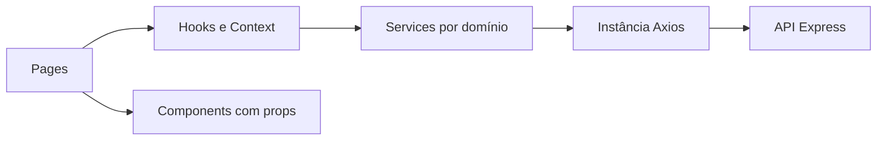

<!-- Documento: docs/30-revisao-da-arquitetura.md -->

# 30 · Revisão da arquitetura

[← Anterior](29-variaveis-de-ambiente.md) · [Índice](../README.md) · **Etapa 30 de 36** · [Próxima →](31-renderizacoes.md)

**Ponto de partida:** conclua a conferência do capítulo 29 antes de avançar. Os caminhos partem da raiz do frontend, onde fica `package.json`. Comandos são para o **CMD**.

## Resultado desta etapa

Arquitetura é revisada a partir das responsabilidades já construídas.

**Conceitos praticados:** arquitetura por responsabilidade, features, coesão, imports, pages, components, hooks, contexts, services, types e utils.

## 1. Ler a arquitetura que existe



```text
src/
├── main.tsx
├── App.tsx
├── components/   # Layout, guarda, cartão, formulário, modal, estados
├── pages/        # Login, Home, Clientes, Novo, Detalhes, Editar
├── contexts/     # Contratos e Providers de autenticação e avisos
├── hooks/        # useAuth, useClientes, useToast
├── services/     # api, authService, clienteService
├── types/        # JSON e entradas tipadas
├── utils/        # Validação e mensagens HTTP
└── examples/     # Demonstrações isoladas, fora do fluxo do produto
```

## 2. Escolher uma reorganização somente com motivo

A estrutura atual separa responsabilidades técnicas. Ela não é automaticamente “feature-based” apenas por ter pastas pages e services. Uma organização por feature reuniria os arquivos de clientes dentro de `features/clientes`.

| Responsabilidade atual | Possível destino futuro |
|---|---|
| pages/ClienteNovo e ClienteEditar | features/clientes/pages |
| ClienteForm e ClienteCard | features/clientes/components |
| useClientes | features/clientes/hooks |
| clienteService | features/clientes/services |
| Layout e AsyncState | shared/components |
| AuthProvider | features/auth |

Este capítulo **não move arquivos**. Assim os imports dos capítulos seguintes permanecem válidos. Para praticar uma reorganização, faça uma cópia ou branch de exercício e atualize todos os imports antes de seguir nela.

## 3. Auditar as fronteiras

- Componente de apresentação conhece props, não endpoint.
- Service conhece HTTP, não JSX nem Router.
- Hook conhece estado e lifecycle, não precisa controlar toda navegação.
- Page reúne componentes e operações para uma rota.
- Utils puras não dependem de estado React.
- Context só abriga dados necessários a vários consumidores.

Uma pasta utils com lógica de autorização de servidor é sinal de responsabilidade incorreta. A interface não decide quais pedidos a API deve autorizar.

```bat
npm run build
```
## Conferência antes de avançar

- [ ] Estudante explica o caminho de uma operação do clique ao servidor.
- [ ] Não há mudanças de pasta sem atualização dos imports.
- [ ] Build continua passando.

## Prática do estudante

Escolha um arquivo e justifique sua pasta. Proponha uma mudança apenas se facilitar localizar ou alterar uma responsabilidade real; não reorganize por estética.

## Se algo falhar

Imports quebrados depois de um exercício de mudança devem ser corrigidos pelo novo caminho. Verifique maiúsculas e minúsculas: o Windows pode tolerar diferenças que falham no Linux.

Referências: [Construindo a interface por componentes](https://react.dev/learn/thinking-in-react).

[← Anterior](29-variaveis-de-ambiente.md) · [Índice](../README.md) · [Próxima →](31-renderizacoes.md)
